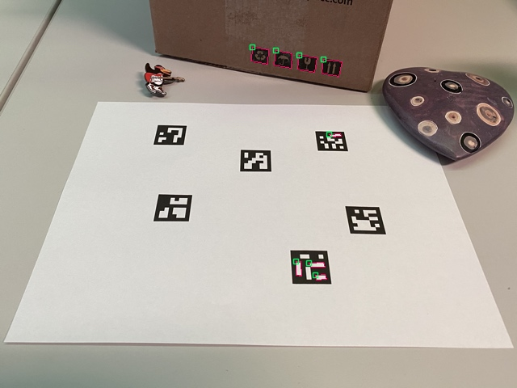
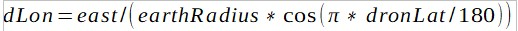

# Object Detection and drone landing
### (neural network for object detection) - Darknet can be used on [Linux](https://github.com/AlexeyAB/darknet#how-to-compile-on-linux) and [Windows](https://github.com/AlexeyAB/darknet#how-to-compile-on-windows-using-vcpkg)

More details: http://pjreddie.com/darknet/yolo/

### Table of contents

1.  [Raspberry Pi setup](#raspberry-pi-setup)
    * [Operating system installation on Raspberry Pi](#operating-system-installation-on-raspberry-pi) 
    * [Remote Access to the Raspberry Pi](#remote-access-to-the-raspberry-pi)
    * [Camera Calibration and code explanation](#camera-calibration-and-code-explanation)
2.  [Drone part](#drone-part)
    * [Drone Calibration](#drone-calibration)
    * [Drone Setup](#drone-setup)
3.  [Raspberry Pi to Pixhawk connection](#raspberry-pi-to-pixhawk-connection)
4.  [Landing with aruco marker approach](#landing-with-aruco-marker-approach)
    * [Aruco marker](#aruco-marker)
    * [Marker creation](#marker-creation)
    * [Marker detection](#marker-detection)
    * [Landing algorithm - code explanation](#landing-algorithm-code-explanation)
    * [Testing phase](#testing-phase)
5.  [Computer Vision](#computer-vision)
    * [CNN and Transfer learning](#cnn-and-transfer-learning)
    * [Object Detection](#object-detection)
    * [Yolo](#yolo)
    * [mAP](#map)
6.  [Yolo implementation](#yolo-implementation)
    * [Data Collection](#data-collection)
    * [Annotation](#annotation)
    * [GPU Support](#gpu-suppor)
    * [Training tiny yolo v3 in Google Colab](#training-tiny-yolo-v3-in-google-colab)
    * [NNPack](#nnpack)
    * [Testing the model](#testing-the-model)
7.  [Landing algorithm with Object Detection](#landing-algorithm-with-object-detection)


### Raspberry Pi setup
#### Operating system installation on Raspberry Pi
#### Remote Access to the Raspberry Pi
#### Camera Calibration - code explanation


### Drone part
#### Drone Calibration
#### Drone Setup

### Raspberry Pi to Pixhawk connection

### Landing with aruco marker approach
#### Aruco marker

An ArUco marker is a black square marker with inner binary representation of identifier. Having black borders, these markers are easy to detect in a frame.


> Aruco Marker Samples

For each the specific application a dictionary – a set of markers – is defined. Dictionaries have such properties as the dictionary size and the marker size. The size of dictionary is defined by the number of markers it contains, and the marker size is the number of bits it has in the inner part.
The identification code of marker is not the result of conversion of binary image to a decimal base, but the marker index in the dictionary. The reason is that for high number of bits the results may become unmanagable. 

#### Marker creation
OpenCV library provides methods to create and detect aruco markers. The drawmarker() method is defined for generating markers. Dictionary should be chosen beforehand. Example:

```c
cv::Mat markerImage;
cv::Ptr<cv::aruco::Dictionary> dictionary cv::aruco::getPredefinedDictionary(cv::aruco::DICT_6X6_250);
cv::aruco::drawMarker(dictionary, 23, 200, markerImage, 1);
cv::imwrite("marker23.png", markerImage);`
```

Parameters:
-      Dictionary object, created from getPredefinedDictionary method
-      marker id – should be in the range, defined for the selected dictionary
-      the size of marker in pixels
-      output image
-      black border width, expressed by the number of internal bits (optional, default equals 1)

There are also online aruco generators, one of which was used in this project. As an example, http://chev.me/arucogen/ website can be mentioned.

#### Marker detection

The goal of marker detection is to return the position and id of the each marker found in the image. This process can be divided to two steps:

1.  Possible candidates’ detection – return all the square shapes and discard non convex ones, by analyzing contours of each figure.
2.  For each candidate its inner codification is analyzed. Several actions are taken as:
    • transformation to canonical form
    • black and white bits are separated
    • division to cells in accordance with marker size
    • the number of black and white pixels is counted to determine the color of cell
    • the bits are analyzed to their relevance to the selected dictionary

Results of detection can be visualised


>Detected markers


>Rejected markers


detectMarkers() function from the aruco module is used for detection. Parameters:
    • image with markers for detections
    • the dictionary object
    • structure of marker corners
    • list of marker ids
    • DetectionParameters class object – used for customizing detection parameters
    • list of rejected parameters 

Example:

```c
cv::Mat inputImage;
std::vector<int> markerIds;
std::vector<std::vector<cv::Point2f>> markerCorners, rejectedCandidates;
cv::Ptr<cv::aruco::DetectorParameters> parameters = cv::aruco::DetectorParameters::create();
cv::Ptr<cv::aruco::Dictionary> dictionary = cv::aruco::getPredefinedDictionary(cv::aruco::DICT_6X6_250);
cv::aruco::detectMarkers(inputImage, dictionary, markerCorners, markerIds, parameters, rejectedCandidates);
```

The found markers can be drawn using drawDetectedMarkers(). Example:
```c
cv::Mat outputImage = inputImage.clone();
cv::aruco::drawDetectedMarkers(outputImage, markerCorners, markerIds);
```

#### Camera Pose Estimation

Camera pose can be obtained from the markers position if the camera was calibrated (camera matrix and distortion coefficients are available). The camera pose is the transformation from the marker coordinate system to the camera coordinate system. Rotation and transformation are estimated in the form of vectors.

```c
cv::Mat cameraMatrix, distCoeffs;

std::vector<cv::Vec3d> rvecs, tvecs;
cv::aruco::estimatePoseSingleMarkers(markerCorners, 0.05, cameraMatrix, distCoeffs, rvecs, tvecs);
```
There rvecs and tvecs are rotation and transformation vehicles respectively.

#### Landing algorithm and code explanation

The algorithm steps:

1) check the aruco class object for new detection. ArucoSingleTracker  is a wrapper class for the access to aruco API.

```c
marker_found, x_cm, y_cm, z_cm = aruco_tracker.track(loop=False) 
```

loop = False – do detection once.

Output:
marker_found – flag, indicating that marker was found, boolean
x_cm – x coordinate of the marker on the image
y_cm – y coordinate of the marker on the image
z_cm – z coordinate of the marker on the image, for the images taken from less than 5 meters, z_cm is taken as an altitude of the drone.

2) If marker_found is True convert x and y coordinates from camera coordinate system to drone coordinate system. The formula is


where  are board frame coordinates,  are camera frame coordinates.

3) Drone can navigate to the location of marker with or without altitude reduction. The decision is done according the angle between drones vertical axis and the vector to the marker. This angle indicates drones closeness to the marker and commands to move with landing when it is less than some threshold values. The command  of moving with descend is given if the expression

 
 
returns true value, where   and   in radians.

4) Calculate latitude and longitude from the marker coordinates. The algorithm was taken from gis portal and is relatively accurate over small distances (10m within 1km). First, north and east attitudes should be calculated for the current yaw of drone. Yaw is a rotation indicator in horizontal space.

 

 
 
  

Second, latitude and longitude are calculated. Drone’s coordinate is taken from GPS, earth radius is taken approximately 6378137 meters.





5) If the height of drone is less than some threshold altitude, perform vertical landing by changing the mode of vehicle to “LAND” value.

```c
vehicle.mode = "LAND" 
```
#### Testing phase

### Computer Vision
#### CNN and Transfer learning
#### Object Detection
#### Yolo
#### mAP

### Yolo implementation
#### Data Collection
#### Annotation
#### GPU Support
#### Training tiny yolo v3 in Google Colab
#### NNPack
#### Testing the model

### Landing algorithm with Object Detection
